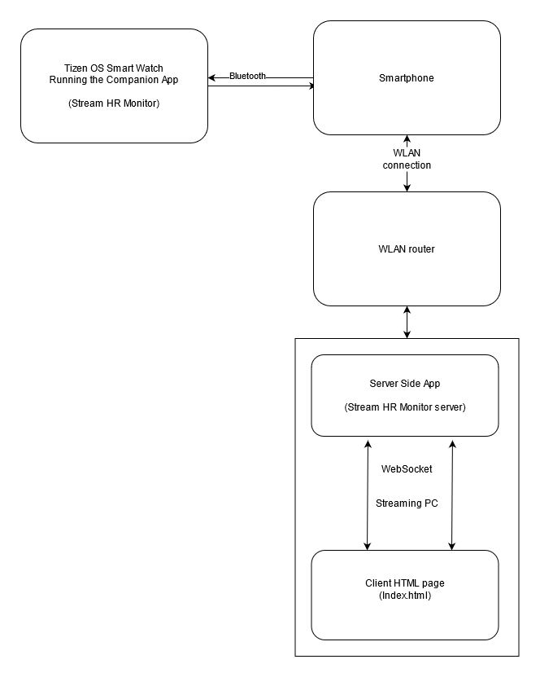

# Stream HR Monitor

Simple server side app for showing your heart rate in a stream made by utilizing WebSockets. Requires Tizen OS smart watch companion app available [here](linkhere) and source code [here](linkhere). The server app is written in JavaScript and runs on NodeJS. I know, there would've been better suited technologies for this, but JavaScript is what I know and you gotta take the wins you can. 

I've used [nexe](https://github.com/nexe/nexe) and [UPX](https://upx.github.io/) to build the release versions available [here](linkhere).

## App architecture

The Stream HR Monitor Watch App communicates to the server side app (this one) via WebSockets. It uses the IP and port set in the app settings to setup WebSocket connection to transmit the heart rate. If you have paired your watch to your app to a smartphone, **the smartphone must be in the same local area network as this application**.  If you haven't paired your smartwatch to a smartphone, the watch must be in the same local area network as this application. The diagram shows how the communication flows if you have paired the watch to a phone which is in a network with the PC. 

The Watch connects to this application via WebSocket. When the connection is made, the app starts keeping only the current heart rate in memory. When a web page ([for example](./views/index.html)) is shown on OBS or web browser, it tries to connect to WebSocket server at 127.0.0.1:3001 which is server by Stream HR Monitor. 

## Installing for development 

Clone the repo, start programming. 

## How to use

1. Install the companion app into the watch
2. Get the latest release of this app from [here](linkhere)
3. Make sure that your watch is paired to your phone, and that the phone is in same WLAN as your PC.
4. Start Stream HR Monitor Server. It will prompt you to set the ports. Defaults are good, if you don't know what you are doing.
5. Start the companion app
6. Go check your **LOCAL IP** and put it on the companion app settings. If you don't know how to find your local IP, refer to these articles. [Microsoft](https://support.microsoft.com/en-us/windows/find-your-ip-address-in-windows-f21a9bbc-c582-55cd-35e0-73431160a1b9) and [Lifehacker](https://lifehacker.com/how-to-find-your-local-and-external-ip-address-5833108)
7. Set the web page you downloaded from the releases as a source to the streaming software of your choice. For example [OBS](https://obsproject.com). Refer to their manuals if you don't know how to do it. 
8. You should see "WEB PAGE CONNECTED" message in the black box that is the Stream HR Monitor Server
9. Click "START" from the Watch App. You should see "WATCH CONNECTED" in the same black box
10. Your heart rate should appear in the web page now. 

## Licence 

MIT